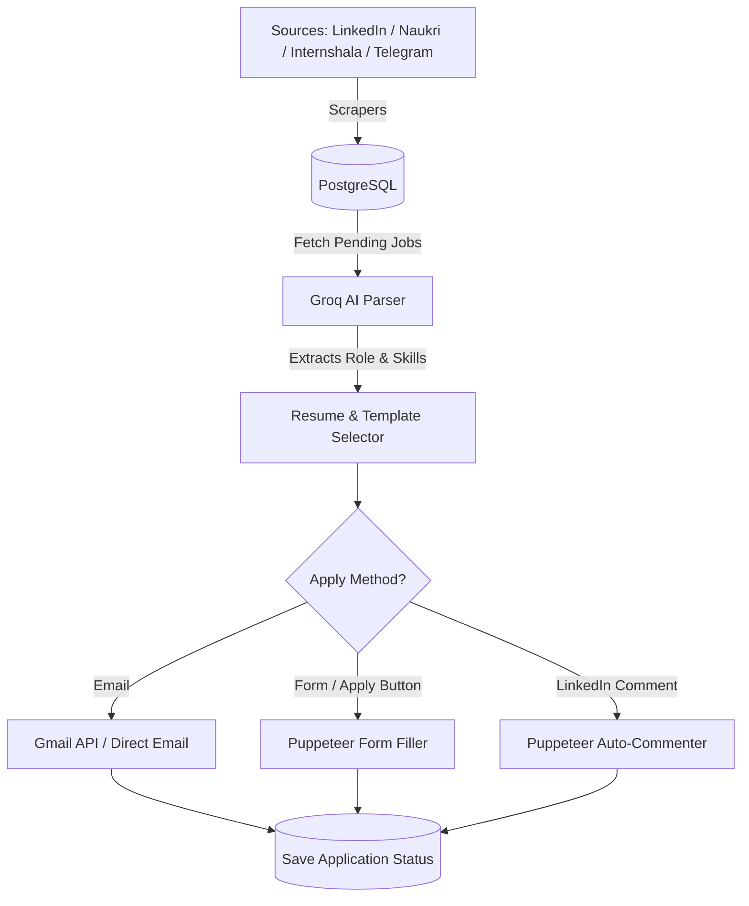

# AutoJob AI 🤖💼

AutoJob AI is a high-performance, multi-user job application automation SaaS platform. It scrapes job listings from sources like LinkedIn, Naukri, Internshala, and Telegram, processes and parses them using Llama 3 (via Groq AI), matches the candidate's skills with the best-fitting resume, and automatically applies to the jobs using either direct cold emails (Gmail API) or browser automation (Puppeteer).

---

## 🚀 Key Features

*   **Multi-Source Aggregator:** Scrapes jobs on a customizable schedule from LinkedIn, Naukri, Internshala, and Telegram channels.
*   **AI-Powered JD Parser:** Uses Groq AI (Llama 3) to extract job details, roles, required skills, and match score dynamically.
*   **Smart Resume Matcher:** Evaluates the job requirements against multiple uploaded resumes (e.g., Fullstack vs. Backend) and selects the best fit.
*   **Automated Apply Handlers:**
    *   **Email Apply:** Drafts personalized cover emails and attaches the correct resume via Gmail API.
    *   **Button/Form Apply:** Automates form-filling and resume uploads on platform application forms using Puppeteer.
    *   **Comment Apply:** Automates LinkedIn post commenting ("Interested") with human-like delays to bypass anti-bot mechanisms.
*   **Bank-Grade Security:** Encrypts user API keys and session cookies (e.g., LinkedIn `li_at`) at rest using **AES-256-CBC** encryption.
*   **SaaS-Ready & Monetized:** Built-in multi-tier subscription engine with Razorpay integrations, subscription verification, and usage limits.

---

## 🛠️ Technology Stack

| Layer | Technology |
| :--- | :--- |
| **Backend** | Node.js, TypeScript, Express.js |
| **Database & ORM** | PostgreSQL, Drizzle ORM, Drizzle Kit |
| **AI Processing** | Groq API (Llama 3) |
| **Automation** | Puppeteer (with stealth/anti-fingerprinting libraries) |
| **API Integrations** | Gmail API (OAuth2), Razorpay API |
| **Scheduling** | node-cron |
| **Security** | Node.js `crypto` (AES-256-CBC), JWT-based auth |

---

## 📋 System Architecture



---

## 📁 Project Structure

```
├── backend/
│   ├── src/
│   │   ├── common/                # Shared configurations, DB initialization, middleware, utilities
│   │   │   ├── config/            # Env loaders and validation
│   │   │   ├── db/                # Schema definitions and migrations
│   │   │   ├── middleware/        # JWT auth, error handlers, Zod validation
│   │   │   └── utils/             # Encryption helpers, file storage, JWT tokens
│   │   │
│   │   └── modules/               # Functional modules
│   │       ├── auth/              # Registration, login, and sessions
│   │       ├── users/             # Profile management and subscription checks
│   │       ├── resume/            # Multi-resume upload and storage
│   │       ├── apiKeys/           # Encrypted API key storage
│   │       ├── scraper/           # Multi-platform scrapers (cron-driven)
│   │       ├── ai/                # Groq JD parsing & matching
│   │       ├── apply/             # Application routers & Puppeteer/Gmail handlers
│   │       ├── jobs/              # Scraped jobs store
│   │       └── applications/      # Audited application histories
│   │
│   ├── drizzle/                   # Auto-generated SQL migrations
│   ├── package.json
│   └── tsconfig.json
```

---

## ⚙️ Setup & Installation

### 1. Prerequisites
*   Node.js (v18+ recommended)
*   pnpm (recommended) or npm/yarn
*   PostgreSQL database instance

### 2. Installation
Clone the repository and install dependencies:
```bash
git clone https://github.com/your-username/autojob-ai.git
cd autojob-ai/backend
pnpm install
```

### 3. Environment Variables Configuration
Create a `.env` file in the `backend/` directory. You can copy the variables from `.env.example`:
```bash
cp .env.example .env
```
Ensure you fill out the following fields in `.env`:
*   `DATABASE_URL`: Connection string for your PostgreSQL database.
*   `MASTER_ENCRYPTION_KEY`: A secure 32-character hex key used to encrypt user cookies and tokens at rest.
*   `JWT_SECRET`: Secret key for signing JSON Web Tokens.

### 4. Database Setup & Migrations
Generate and run migrations to create the tables in PostgreSQL:
```bash
# Generate SQL migrations based on drizzle schemas
pnpm drizzle-kit generate

# Run migrations to update the database
pnpm drizzle-kit migrate
```

### 5. Running the Application
To start the backend server in development mode:
```bash
pnpm run dev
```

---

## 🔒 Security Checklist

*   **AES-256-CBC Encryption:** User API keys (Groq) and session cookies (`li_at`) are encrypted before database insertion. They are only decrypted in-memory during scraping/applying tasks and are never logged or exposed via API endpoints.
*   **Stealth Automation:** Puppeteer scrapers run stealth scripts with randomized mouse behavior, scrolls, and artificial sleep times (3–8s) to prevent platforms from detecting and banning accounts.
*   **Token Lifecycle:** Short-lived JWTs combined with encrypted refresh tokens stored securely in the database.
